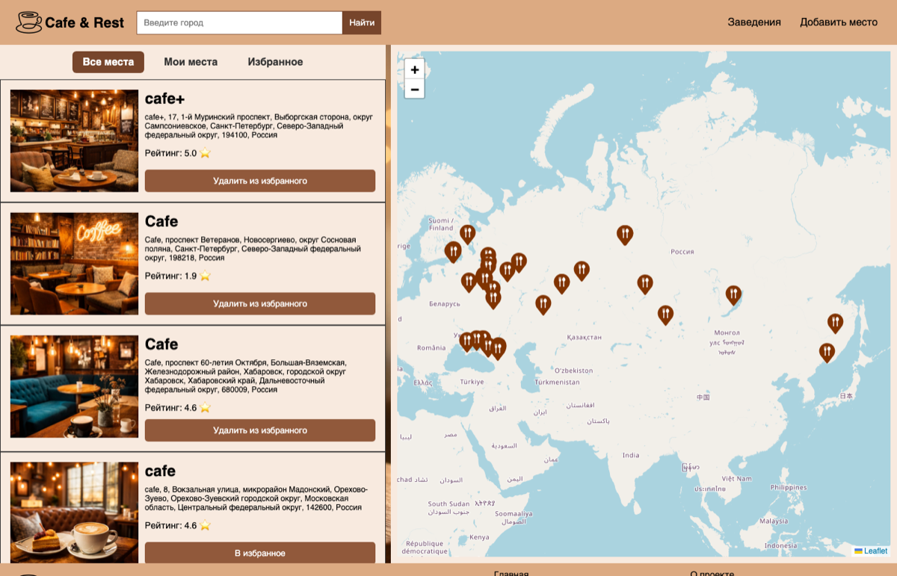

<p align="center">
  
</p>

<p align="center">
  
</p>

<p align="center">
  
  
  
  
  
</p>

---

# ☕ Cafe & Rest

**Cafe & Rest** — веб-приложение на Flask для поиска кафе и ресторанов на интерактивной карте. Данные о заведениях подтягиваются из OpenStreetMap (Nominatim), а пользователь может добавлять свои места, ставить оценки и сохранять понравившиеся точки в избранное.

## ✨ Основные возможности

- 🗺️ Интерактивная карта заведений на Leaflet.js
- 🔍 Поиск кафе и ресторанов по городу через OpenStreetMap Nominatim
- ⭐ Избранное — как для мест из OSM, так и для добавленных пользователем
- ➕ Добавление своего заведения с фото, адресом и рейтингом
- 📍 Автоматическое геокодирование адреса в координаты
- 💾 Хранение данных в SQLite через SQLAlchemy ORM

---

## 📸 Скриншоты

### 🏠 Главная страница

Карта с заведениями и список места слева. Можно искать по городу, переключаться между всеми местами, своими и избранными.

<p align="center">
  
</p>

---

### ➕ Добавление места

Пользователь может загрузить фото своего заведения, указать название, адрес и рейтинг — адрес автоматически геокодируется и попадает на карту.

<p align="center">
  
</p>

---

## 🛠️ Стек технологий

| Слой       | Технология                  |
| ---------- | --------------------------- |
| Backend    | Flask                       |
| ORM / БД   | SQLAlchemy + SQLite         |
| Карта      | Leaflet.js                  |
| Гео-данные | OpenStreetMap Nominatim API |

## 📂 Структура проекта

```
.
├── app.py            # Flask-приложение и маршруты
├── modals.py         # Модели SQLAlchemy (MyPlace, FavoritePlace)
├── utils.py          # Работа с Nominatim API и геокодирование
├── settings.py        # Настройки (имя БД)
├── templates/         # HTML-шаблоны (Jinja2)
├── static/            # CSS, изображения, загруженные фото
└── database.db        # SQLite база данных
```

## 🚀 Запуск

```bash
pip install -r requirements.txt
python app.py
```

Приложение будет доступно на **http://localhost:5000**
